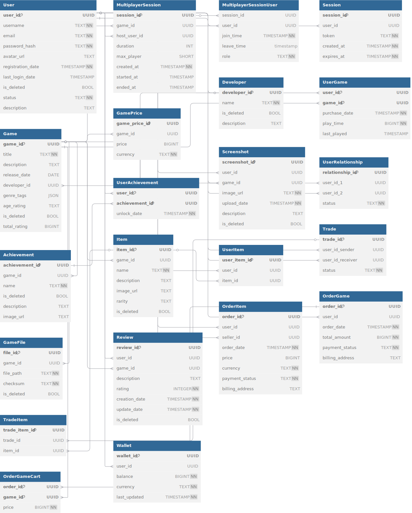
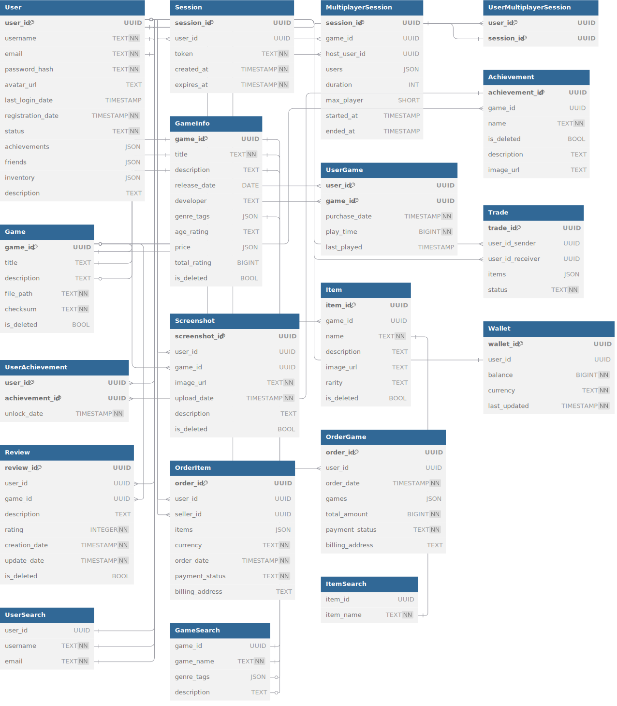

# Проектирование высоконагруженного сервиса Steam

## Содержание
- [1. Тема и целевая аудитория](#1-тема-и-целевая-аудитория)
  - [Целевая аудитория](#целевая-аудитория)
  - [Функционал](#функционал)
- [2. Расчет нагрузки](#2-расчет-нагрузки)
  - [Продуктовые метрики](#продуктовые-метрики)
    - [Средний размер хранилища](#средний-размер-хранилища)
    - [Действия пользователей](#действия-пользователей)
  - [Технические метрики](#технические-метрики)
    - [Хранилище](#хранилище)
    - [Сетевой трафик](#сетевой-трафик)
    - [RPS](#rps)
- [3. Глобальная балансировка нагрузки](#3-глобальная-балансировка-нагрузки)
  - [Функциональное разбиение по доменам](#функциональное-разбиение-по-доменам)
  - [Расположение ДЦ](#расположение-дц)
  - [Расчет распределение запросов по ДЦ](#расчет-распределение-запросов-из-секции-расчет-нагрузки-по-типам-запросов-по-датацентрам)
  - [Схема балансировки](#схема-балансировки)
- [4. Локальная балансировка нагрузки](#4-локальная-балансировка-нагрузки)
  - [Схемы балансировки для входящих и межсервисных запросов](#схемы-балансировки-для-входящих-и-межсервисных-запросов)
  - [Схема отказоустойчивости](#схема-отказоустойчивости)
  - [Нагрузка по терминации SSL](#нагрузка-по-терминации-ssl)
- [5. Логическая схема БД](#5-логическая-схема-бд)
  - [Схема](#схема)
  - [Расчет размеров](#расчет-размеров)
  - [Требования к консистентности](#требования-к-консистентности)
  - [Шардирование](#шардирование)
- [Список источников](#список-источников)

## 1. Тема и целевая аудитория
Steam — это крупнейшая платформа для PC-гейминга, где можно покупать игры, играть в бесплатные проекты, торговать внутриигровыми предметами и общаться с другими игроками.

### Целевая аудитория
Согласно сайту Steamworks MAU Steam состовляет 132M[^1], также на сайте Steam можно посмотреть количество пользователей, которые находятся online[^2].

#### Распределение по странам
Также Steam предоставляет статистику по количеству пользователей в зависимости от страны[^3].

**Количество пользователей Steam в зависимости от страны[^4]:**
| Страна            | Пользователи Steam |
|-------------------|---------------------|
| Соединенные Штаты | 13.7M              |
| Китай             | 11.4M              |
| Россия            | 9.5M               |
| Бразилия          | 4.9M               |
| Германия          | 3.6M               |
| Канада            | 3M                 |
| Турция            | 2.8M               |
| Франция           | 2.8M               |
| Великобритания    | 2.6M               |
| Польша            | 2.4M               |

### Функционал 
Основной функционал сервиса **заключается в покупке игр**.

**Функционал MVP**:
- Регистрация и авторизация
- Корзина для покупки игр
- Каталог игр для покупки: фильтры по жанрам, поиск, рекомендации
- Библиотека пользователя, которая позволяет запускать/устанавливать игры
- Торговая площадка для игровых предметов
- Система профилей: можно добавлять друзей, чтобы играть с ними по сети
- Интеграция Steam в игры: статистика по играм для пользователя, ачивки, мультиплеер, игровые предметы

**Ключевые продуктовые решения**:
- **Steamworks API**: используется для интеграции функций Steam в игры, реализован на основе HTTP и gRPC[^1];
- **Steam Guard (двухфакторная аутентификация)**: использует мобильное приложение Steam для генерации кодов[^5];

## 2. Расчет нагрузки

### Продуктовые метрики
- Месячная аудитория (MAU): 132M[^1]
- Дневная аудитория (DAU): 69[^6]

#### Средний размер хранилища
**Профиль пользователя:**
| Хранимые данные         | Средний размер |
|-------------------------|----------------|
| Аватарка                | 15 кб          |
| Скриншоты               | 7.5 мб         |
| Информация профиля      | 2 мб           |

- при загрузке автатарка пользователя автоматически рескейлится до 128x128 px, средний размер получается ~15 кб, максимальный возможный размер -- 1 мб; 
- размеры скриншотов варируются от 50 кб до 1.5 мб, в среднем получается где-то 250 кб на один скриншот, в среднем у пользователя ~30 скриншотов; 
- информация пользователя: описание, ачивки, библиотека игр, список друзей, комментарии профиля...

**Игровой предмет:**
| Хранимые данные         | Средний размер |
|-------------------------|----------------|
| Картинка                | 70 кб          |
| Информация о предмете   | 100 кб           |

- размер картинки может меняться в зависимости от игры, в среднем получается 70 кб;
- информация о предмете: описание, редкость, из какой игры...

**Игра:**
| Хранимые данные         | Средний размер |
|-------------------------|----------------|
| Скриншоты и трейлеры    | 15 мб          |
| Информация об игре      | 1 мб           |
| Файлы игры              | 25 гб          |

- в среднем у игры 3 трейлера (средний размер трейлера 3.5 мб) и 15 скриншотов (средний размер 250кб), если округлять получится ~15 мб на все; 
- информация об игре: описание, тэги, системные требования...;

#### Действия пользователей
| Действие                      | Количество (раз в день)  |
|-------------------------------|--------------------------|
| Регистрация/авторизация       | 0.0323                   |
| Просмотр игр [^7]             | 2.8000                   |
| Покупка игр [^8]              | 0.0075                   |
| Комментарий к игре [^9]       | 0.0002                   |
| Скачивание игр                | 0.0301                   |
| Обновление игр                | 1.5714                   |
| Совершить трейд [^10]         | 0.3623                   |
| Просмотр профилей             | 2.5000                   |
| Просмотр игровых предметов    | 5.0000                   |
| Обновление информации профиля | 0.0323                   |
| Загрузка скриншотов/видео     | 0.1612                   |
| Обновление статуса            | 6.0000                   |
| Мультиплеер                   | 0.8775                   |

- пользователь в среднем авторизируется в Steam 1 раз в месяц;
- согласно SteamSpy[^8] (статистика за 2017) на пользователя, в среднем, приходится ~11 игр, а средний возраст аккаунтов ~4 лет;
- согласно [^9] медианное значение множителя для игр ~40, т.е. на один отзыв приходится 40 проданных игр;
- если учесть, что у пользователя в среднем появляется 11 игр за год, а также, то что в steam игры обычно обновляются раз в неделю, получим, что в среднем пользователь обновляет 11 игр в неделю;
- согласно [^10] за последний месяц было в среднем 2.5M трейдов в день => количество трейдов = 2.5 / DAU;
- согласно [^15], в среднем, пользователи играют 3 часа в день, одна игровая сессия длиться ~1 час, получаем, что пользователь запускает игру 3 раза в день. Для игры по сети Steam использует `ISteamFriends` из steamworks api [^14], когда пользователь запускает игру этот интерфейс позволяет обновить его статус (показать что он играет в игру), после этого его друзья могут отправить запрос на совместную игру, статус также обновляется при выходе из игры;
- для того, чтобы играть по сети надо добавить пользователя в группу, одна мультиплеер сессия длится ~40 минут, согласно [^16] отношение времени, проведенному в онлайн играх, ко времени в одиночных играх $595 / 1509 \approx 0.39$, если учитывать, что 50% игроков играют в онлайн игры с друзьями получаем: $180 / 40 * 0.39 * 0.5 \approx $ для оценки мультиплеера

### Технические метрики

#### Хранилище
- на данный момент в Steam ~130K игр [^11] => для хранения игр понадобится: 
$130000 \times (25гб + 16мб) \approx 3.25208пб$
- согласно [^12] на 2020 год было ~667M аккаунтов, пририост начиная с 2017 ежигодны прирост пользователей ~63M в год [^8], получаем 919M пользователей на конец 2024 года => на хранение данных пользователей понадобится:
$919 \times 10^6 \times (9.5мб + 15кб) \approx 8.744285пб$
- количество уникальных предметов в Steam Market ~$10^5$ на хранение надо:
$10^5 \times (100кб + 70кб) \approx 17гб$

**Итог: 11.996382 пб** 

#### Сетевой трафик
**DAU = 69M**

Расчет общей нагрузки (в Гбит/с):
- Просмотр игр:
$2.8DAU \times 16мб \div 86400 с \approx 35.8 гб/c = 286.4 гбит/с$
- Просмотр профиля:
$2.5DAU \times (2мб + 15кб) \div 86400 с \approx 4.0 гб/c = 32.0 гбит/с$
- Просмотр предметов:
$5DAU \times 170кб \div 86400 с \approx 0.679 гб/c = 5.432 гбит/с$
- Скачивание игр:
$0.0301DAU \times 25гб \div 86400 с \approx 600.95 гб/c = 4807.6 гбит/с$
- Обновление игр:
$1.5714DAU \times 0.05 \times 25гб \div 86400 с \approx 1568.67 гб/c = 12549.36 гбит/с$
- Покупка игры:
$0.0075DAU \times 1мб \div 86400 с \approx 0.006 гб/c = 0.048 гбит/с$

Для пика был выбран множитель x2 согласно [^13].

| Действие             | Общая нагрузка [Гбит/с] | Общая нагрузка (пик) [Гбит/с] | Суточная нагрузка [Гбайт/сутки] |
|----------------------|----------------------------|----------------------------------|------------------------------------|
| Просмотр игр         | 286.4                      |  572.8                           | 3 093 120                          |
| Просмотр профиля     | 32.0                       |  64.0                            | 345 600                            |
| Просмотр предметов   | 5.432                      |  10.864                          | 58 604.4                           |
| Скачивание игр       | 4807.6                     |  9615.2                          | 51 922 080                         |
| Обновление игр       | 12549.36                   |  25098.72                        | 135 533 088                        |
| Покупка игры         | 0.048                      |  0.096                           | 0.5184                             |

#### RPS
Использую таблицу с действиями пользователя можно посчитать RPS: 
$RPS = actionCount \times DAU \div 86400$

| Действие                      | RPS        | RPS (пик)       |
|-------------------------------|------------|-----------------|
| Регистрация/авторизация       | 25.80      | 51.60           |
| Просмотр игр                  | 2236.11    | 4472.22         |
| Покупка игр                   | 5.99       | 11.98           |
| Комментарий к игре            | 0.16       | 0.32            |
| Скачивание игр                | 24.04      | 48.08           |
| Обновление игр                | 1254.94    | 2509.88         |
| Совершить трейд               | 289.34     | 578.68          |
| Просмотр профилей             | 1996.53    | 3993.06         |
| Просмотр игровых предметов    | 3993.06    | 7986.12         |
| Обновление информации профиля | 25.80      | 51.60           |
| Загрузка скриншотов/видео     | 128.74     | 257.47          |
| Обновление статуса            | 4791.67    | 9583.34         |
| Мультиплеер                   | 700.78     | 1401.56         |

## 3. Глобальная балансировка нагрузки

### Функциональное разбиение по доменам
Будем считать, что основным доменом будет `steam.com`, имеет смысл сделать отдельный домен для раздачи игр `content.steam.com`.

### Расположение ДЦ
Steam отрыто предоставляет статистику скачиваний в зависимости от региона [^13]:

**Пример расположения серверов:**
Для обслуживания `steam.com`:
- *Северная Америка:* Ашберн, Даллас, Чикаго, Лос-Анджелес, Торонто, Ванкувер, Майами;
- *Европа:* Лондон, Париж, Стокгольм, Амстердам;
- *Азия:* Токио, Сингапур, Мумбаи;
- *Россия:* Москва;
- *Южная Америка:* Сан-Паулу, Богота;
- *Океания:* Сидней;
- *Ближний Восток:* Дубай.

Для обслуживания `content.steam.com`:
- *Северная Америка:* Сиэтл;
- *Европа:* Франкфурт.

*Синий цвет ДЦ, которые обслуживают `steam.com`, красный -- `content.steam.com`.*

### Расчет распределение запросов из секции "Расчет нагрузки" по типам запросов по датацентрам

| Регион                  | Использование (%) |
|-------------------------|-------------------|
| **Северная Америка**    | 39.67             |
| **Европа**              | 23.55             |
| **Азия**                | 13.64             |
| **Россия**              | 3.61              |
| **Южная Америка**       | 11.98             |
| **Океания**             | 2.20              |
| **Ближний Восток**      | 4.13              |
| **Африка**              | 0.43              |
| **Центральная Америка** | 0.60              |

Используя эту таблицу и данные из [расчета нагрузки](#2-расчет-нагрузки), получаем:

| Регион               | Общий RPS  |
|----------------------|------------|
| Северная Америка     | 12275.81   |
| Европа               | 7287.84    |
| Азия                 | 4221.45    |
| Россия               | 1116.84    |
| Южная Америка        | 3707.15    |
| Океания              | 680.82     |
| Ближний Восток       | 1277.31    |
| Африка               | 132.91     |
| Центральная Америка  | 183.67     |

### Схема балансировки
Т.к. Steam-ом пользуются во всем мире имеет смысл применять Geo-based DNS.

Можно выделить следующие регионы с большим трафиком: **Северная Америка**, **Европа**, **Азия**. Для этих регионов имеет смысл использовать bgp anycast для равномерного распределения пользователей по ДЦ. В рамках каждого региона все дата-центры будут использовать один общий IP-адрес в глобальной сети.

## 4. Локальная балансировка нагрузки

### Схемы балансировки для входящих и межсервисных запросов
После того, как запрос приходит в ДЦ начинается локальная балансировка. Локальная балансировка будет включать два уровня:
- **L4-балансировка:** будет реализована с помощью IPVS (Linux Virtual Server)
- **L7-балансировка:** будет использовать ingress-контроллер (ingerss-nginx)

Для каждого региона будет использоваться свой kubernetes кластер, когда запрос приходит в ДЦ он поподает на L4 балансировщик, который знает только про ingress-nginx, которые находятся в данном ДЦ. L4 балансировщик выбирает (round-robin) одну из нод в кластере kubernetes, где запущен ingress-nginx. Ingress-nginx балансирует запросы на уровне L7, отправляя на нужный service, который выбирает конкретный под.

### Схема отказоустойчивости
Для того, чтобы обеспечить отказоустойчивость на L4 слое будем использовать keepalived. В случае L7 балансировки будем использовать специальный endpoint (`/health`) для проверки статуса сервера.

Кроме этого для обеспечения отказоустойчивости будут использоваться средства kubernetes: автоматический перезапуск упавших контейнеров, автоматическое масштабирование подов при росте нагрузки, добавление новых узлов в кластер при нехватке ресурсов.

### Нагрузка по терминации SSL
SSL терминацию будем делать на уровне L7 (ingress-nginx). Чтобы снизить количество round-tripов будет использовать session tickets.

Для того, чтобы установить TLS соединение надо ~120мс, пиковое значение rps -- 30946. При использование session tickets подключение будет занимать ~60мс. Пусть для 5% запросов не сохранили сессию, тогда для терминации по SSL каждую секунду надо:
$30946 \times (0.95 \times 0.06 + 0.05 \times 0.12) \approx 1949 с$.
Тут имеется ввиду, что надо 1949с процессороного времени => 1949 ядер.

## 5. Логическая схема БД

### Схема

### Расчет размеров
Можно рассчитать размер одной записи для каждой таблицы:
| Таблица                   | Размер одной записи (байт) |
|---------------------------|----------------------------|
| User                      | 345                        |
| MultiplayerSession        | 83                         |
| MultiplayerSessionUser    | 66                         |
| Session                   | 100                        |
| Game                      | 517                        |
| GamePrice                 | 58                         |
| Developer                 | 98                         |
| UserGame                  | 64                         |
| Achievement               | 105                        |
| UserAchievement           | 48                         |
| Screenshot                | 103                        |
| UserRelationship          | 54                         |
| GameFile                  | 106                        |
| Item                      | 106                        |
| UserItem                  | 36                         |
| Trade                     | 54                         |
| TradeItem                 | 38                         |
| Review                    | 276                        |
| OrderItem                 | 124                        |
| ItemPrice                 | 54                         |
| OrderGame                 | 120                        |
| OrderGameCart             | 48                         |
| Wallet                    | 64                         |

Теперь можно рассчитать размер всех данных:
| Таблица                  | Суммарный размер (байт)                                           |
|--------------------------|------------------------------------------------------------------|
| **User**                 | 919 * 10^6 * 345 = 317.055 Гб                                   |
| **MultiplayerSession**   | 7 * 60 * 10^6 * 83 = 34.914 Гб                                 |
| **MultiplayerSessionUser** | 3 * 7 * 60 * 10^6 * 66 = 41.61 Гб                             |
| **Session**              | 132 * 10^6 * 100 = 12.3 Гб                                     |
| **Game**                 | 130000 * 517 = 67.21 Гб                                        |
| **GamePrice**            | 10 * 130000 * 58 = 0.0724 Гб                                   |
| **Developer**            | 44000 * 98 = 4.3 Мб                                            |
| **UserGame**             | 2 * 11 * 919 * 10^6 * 64 = 1.29 Тб                             |
| **Achievement**          | 130000 * 25 * 105 = 341.25 Мб                                  |
| **UserAchievement**      | 919 * 10^6 * 2 * 11 * 25 * 0.2 = 101.79 Тб                     |
| **Screenshot**           | 919 * 10^6 * 200 * 103 = 189.66 Тб                             |
| **UserRelationship**     | 919 * 10^6 * 10 * 54 = 495.7 Гб                                |
| **GameFile**             | 130000 * 106 = 13.78 Гб                                        |
| **Item**                 | 10000 * 106 = 1.06 Гб                                          |
| **UserItem**             | 919 * 10^6 * 100 * 36 = 3.31 Тб                                |
| **Trade**                | 2.5 * 10^6 * 31 * 24 * 54 = 106.44 Гб                          |
| **TradeItem**            | 8 * 2.5 * 10^6 * 31 * 24 * 38 = 153.41 Гб                      |
| **Review**               | 130000 * 100 * 276 = 3.59 Гб                                   |
| **OrderItem**            | 132 * 10^6 * 100 = 12.3 Гб                                     |
| **ItemPrice**            | 10000 * 10 * 54 = 5.4 Мб                                       |
| **OrderGame**            | 11 * 130000 * 120 = 171.6 Мб                                   |
| **OrderGameCart**        | 2 * 11 * 130000 * 48 = 1.4 Гб                                  |
| **Wallet**               | 919 * 10^6 * 64 = 58.7 Гб                                      |

### Требования к консистентности
- Пользователи: При удалении пользователя необходимо удалить все связанные данные (отзывы, скриншоты, ...);
- Финансовые операции: Покупки, транзакции и пополнения кошелька должны быть атомарными и неизменяемыми, чтобы избежать дублирования или потери данных;
- Игры: При удаление игры надо удалять все связанные с ней данные (отзывы, скриншоты, ...)
- Отзывы и рейтинг игр: Когда пользователь добавляет отзыв, надо пересчитывать рейтинг игры;
- Обмен предметами: Нельзя обменять предмет, если он уже был передан другому пользователю. Надо изменять инвентари пользователей после обмена;
- Достижения: Игрок не может получить достижение, если у него нет соответствующей игры;

### Шардирование
- Пользователи: Поскольку количество пользователей будет увеличиваться имеет смысл использовать шардирование по user_id;
- Игры: Аналогично пользователям, количество игр увеличивается, поэтому будем использовать шардирование по game_id.

## 6. Физическая схема БД

### Схема после денормализации

### Индексы
Для того, чтобы ускорить выполнение запросов используем индексы:
- `User`:
  - индексы на `username`, `email` чтобы быстро получать пользователя;
  - индекс `registration_date` для того, чтобы ускорить сбор статистики;
- `UserInfo`:
  - индекс на `status` для быстрого поиска по статусу пользователей;
- `Game`:
  - индекс на `title` для быстрого поиска по названию;
- `GameInfo`:
  - индекс на `price` для быстрого поиска по цене;
  - индекс на `genre_tags` для быстрого поиска по тэгам;
  - индекс на `release_date` для быстрого поиска по времени релиза;
- `UserGame`:
  - индекс на `last_played` для того, чтобы быстрее формировать список недавних игр;
- `Achievement`:
  - индекс на `game_id` для того, чтобы быстро получать все ачивки для определенной игры;
- `Review`:
  - индекс на `game_id` для быстрого поиска отзывов для определенной игры;
  - индекс на `rating` для того, чтобы быстро считать рейтинг;
- `OrderGame`/`OrderItem`:
  - индекс на `user_id`, чтобы быстро получать все заказы для определенного пользователя;
  - индекс на `order_date`, чтобы быстро сортировать по дате;

### Выбор СУБД
- Для `User`, `Game`, `UserGame`, `Achievement`, `Screenshot`, `Item`, `Wallet` будем использовать PostgreSQL
- Для `UserInfo`, `GameInfo`, `Review` будем использовать MongoDB, т.к. данные в этих таблицах сильно неструктурированные;
- Для `OrderGame`, `OrderItem`, `Trade` будем использовать Tarantool, т.к. обеспечивает высокую производительность и дает ACID-гарантии;
- Для `Session`, `MultiplayerSession` будем использовать Redis;
- Таблицы `UserSearch`, `GameSearch`, `ItemSearch` специально созданы для обеспечения быстрого поиска с помощью Elasticsearch.

### Шардирование и резервирование СУБД
**Шардирование:**
- `User`, `UserInfo`, `Wallet`, `OrderGame`, `OrderItem`, `Screenshot`, `Trade`: шардирование по `user_id`, для равномерного распределения будем использовать hash;
- `Game`, `GameInfo`, `Achievement`, `Item`: шардирование по `game_id`, для равномерного распределения будем использовать hash;
- `UserGame`, `Review`: шардирование будет по композитному ключу (`user_id`, `game_id`);

**Резервирование:**
- PostgreSQL: будем использовать `pg_dump` для бэкапа раз в сутки, также можно применять WAL-журналы для восстановления. Также будем использовать репликацию: для `User`, `Wallet` будет Master-Master, т.к. нужна максимальная надежность, для остальных Master-Slave;
- MonogDB: будем использовать replica set: 1 primary + 2 secondary;
- Tarantool: для формирования бэкапов будем делать снапшоты каждые 5 минут, также будет использоваться WAL. Будем использовать Master-Slave репликацию.

### Клиентские библиотеки / интеграции
Т.к. планируем, что бэкэнд будет на Go, то для работы с PostgreSQL будем использовать драйвер `pgx`. Сервисы, которые взаимодействуют с tarantool можно написать на lua, получится что у нас tarantool будет и application server и БД. Для работы с Redis будем использовать библиотеку `go-redis`. Для того, чтобы обеспечить консистентность данных между базами будем использовать `kafka`.

## Список источников
[^1]: [https://partner.steamgames.com/](https://partner.steamgames.com/)
[^2]: [https://store.steampowered.com/charts/](https://store.steampowered.com/charts/)
[^3]: [https://steam.quers.net/map](https://steam.quers.net/map)
[^4]: [https://worldpopulationreview.com/country-rankings/steam-users-by-country](https://worldpopulationreview.com/country-rankings/steam-users-by-country)
[^5]: [https://help.steampowered.com/en/faqs/view/7EFD-3CAE-64D3-1C31](https://help.steampowered.com/en/faqs/view/7EFD-3CAE-64D3-1C31)
[^6]: [https://www.demandsage.com/steam-statistics](https://www.demandsage.com/steam-statistics)
[^7]: [https://hypestat.com/info/api.steampowered.com](https://hypestat.com/info/api.steampowered.com)
[^8]: [https://ubm-twvideo01.s3.amazonaws.com/o1/vault/gdc2018/presentations/Steam_in_2017.pdf](https://ubm-twvideo01.s3.amazonaws.com/o1/vault/gdc2018/presentations/Steam_in_2017.pdf)
[^9]: [https://dtf.ru/gameindustry/1629749-korrelyaciya-otzyvov-i-prodazh-v-steam](https://dtf.ru/gameindustry/1629749-korrelyaciya-otzyvov-i-prodazh-v-steam)
[^10]: [https://www.trade.tf/volume](https://www.trade.tf/volume)
[^11]: [https://steamdb.info/instantsearch/](https://steamdb.info/instantsearch/)
[^12]: [https://steamdb.info/blog/scanning-all-steam-ids/](https://steamdb.info/blog/scanning-all-steam-ids/)
[^13]: [https://store.steampowered.com/stats/content/](https://store.steampowered.com/stats/content/)
[^14]: [https://partner.steamgames.com/doc/api/isteamfriends](https://partner.steamgames.com/doc/api/isteamfriends)
[^15]: [https://www.researchgate.net/figure/Average-Number-of-Hours-Spent-Gaming-in-a-Typical-Day-for-Female-and-Male-Gamers_fig2_283793880](https://www.researchgate.net/figure/Average-Number-of-Hours-Spent-Gaming-in-a-Typical-Day-for-Female-and-Male-Gamers_fig2_283793880)
[^16]: [https://www.playground.ru/misc/news/sudya_po_vsemu_igroki_ps5_tratyat_gorazdo_bolshe_vremeni_na_odinochnye_igry_chem_na_mnogopolzovatelskie-1674125?utm_source=chatgpt.com](https://www.playground.ru/misc/news/sudya_po_vsemu_igroki_ps5_tratyat_gorazdo_bolshe_vremeni_na_odinochnye_igry_chem_na_mnogopolzovatelskie-1674125?utm_source=chatgpt.com)
[^17]: [https://www.gamedeveloper.com/game-platforms/there-are-44-000-game-developers-on-steam-who-are-they-](https://www.gamedeveloper.com/game-platforms/there-are-44-000-game-developers-on-steam-who-are-they-)
